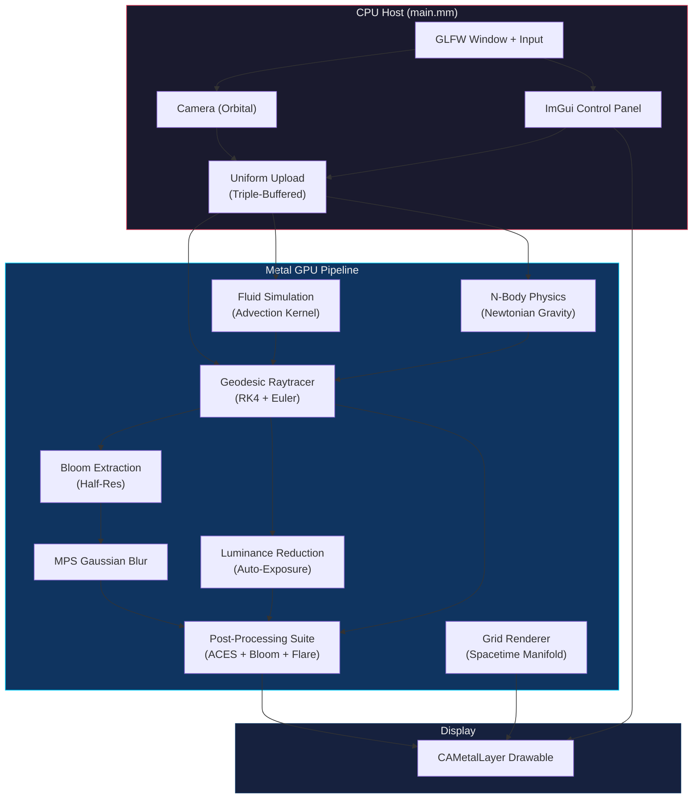
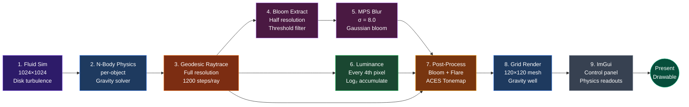
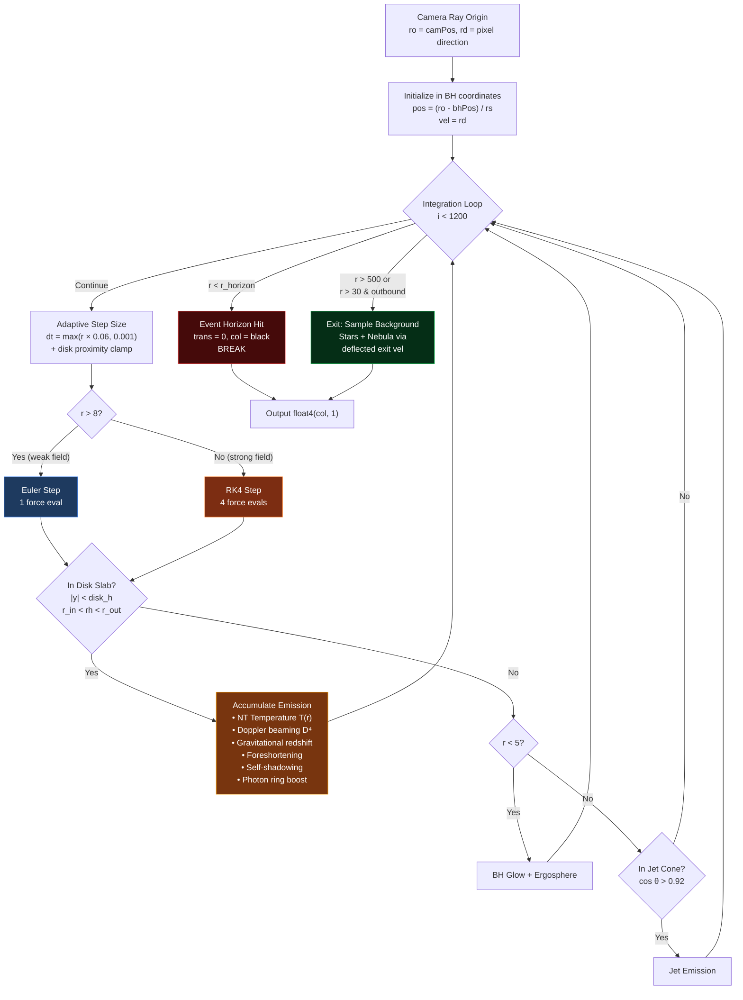
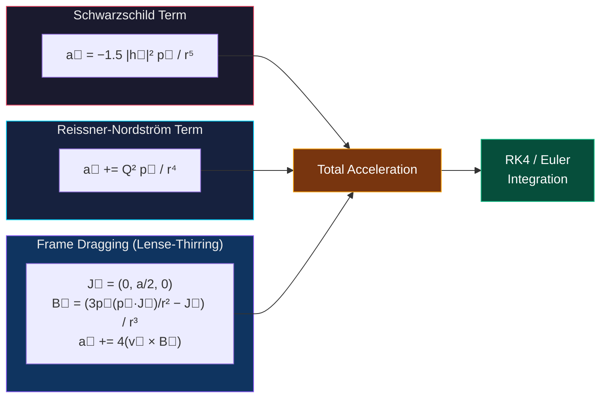
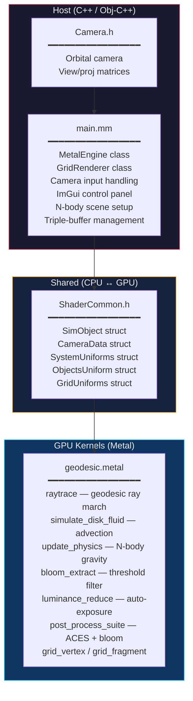

# Metal Blackhole

A high-fidelity, real-time black hole simulation optimized for Apple Silicon via the Metal API. This project implements general relativity geodesics, volumetric plasma physics, and cinematic post-processing to create a physically authentic and visually stunning representation of a Kerr-Newman black hole.


---

## Table of Contents

- [Technical Highlights](#technical-highlights)
- [Architecture](#architecture)
- [GPU Rendering Pipeline](#gpu-rendering-pipeline)
- [Physics Model](#physics-model)
- [Project Structure](#project-structure)
- [Controls](#controls)
- [Building](#building)
- [Presets](#presets)
- [Validation](#validation)
- [Security Considerations](#security-considerations)
- [Credits](#credits)

---

## Technical Highlights

### Core Physics & Metrics
- **Kerr-Newman Metric:** Support for mass, angular momentum (Spin `a`), and electric charge (Charge `Q`).
- **RK4 Geodesic Solver:** 4th-Order Runge-Kutta integration of the effective gravitational potential with gravitomagnetic (Lense-Thirring) frame dragging — the same formulation used by DNEG for *Interstellar*.
- **Dimensionless Units:** Refactored mathematics (`r/rs`) to maintain numerical stability at any scale.
- **N-Body Gravity:** GPU-accelerated Newtonian solver for orbiting companion stars.
- **Spectral Doppler Shift:** Color temperature shifts from orbital velocity — approaching limb blue-shifts, receding limb red-shifts.

### Rendering & Optics
- **Volumetric Accretion Torus:** 5-octave spatiotemporal fBM noise simulating turbulent plasma.
- **Relativistic Effects:** Accurate Doppler beaming (`D⁴`) and gravitational redshift.
- **Novikov-Thorne Disk:** Temperature profile with zero-torque ISCO boundary condition.
- **Volumetric Self-Shadowing:** Secondary ray-marching for realistic internal occlusion.
- **Star Lensing:** Dynamic lensing and smearing of companion stars through curved spacetime.
- **Photon Rings:** Primary, secondary (half-orbit), and higher-order gravitationally focused images.
- **Gravitational Waves:** Quadrupole ripple visualization on the spacetime manifold grid.
- **Polar Relativistic Jets:** Collimated blue-white emission along the spin axis with turbulent noise.
- **Ergosphere Glow:** Faint violet emission inside the static limit surface for spinning black holes.

### Cinematic Suite
- **ACES Filmic Tonemapping:** Hollywood-standard color science.
- **MPS Bloom:** MetalPerformanceShaders Gaussian blur for cinematic glow around bright regions.
- **Anamorphic Lens Flare:** Procedural horizontal streaks from high-intensity sources.
- **Auto-Exposure:** GPU-computed log-luminance histogram with temporal smoothing.
- **Optical Vignette:** Edge darkening for natural lens falloff.
- **Motion Blur:** Temporal feedback loops for shutter-accurate trails.
- **Film Grain:** 70mm grain simulation.

### Performance (Apple Silicon Optimized)
- **Triple Buffering:** Zero CPU-GPU synchronization stalls via `dispatch_semaphore`.
- **Precompiled `.metallib`:** Offline shader compilation for instant startup (graceful fallback to runtime compilation).
- **MTLMathModeRelaxed:** FMA-enabled compilation with IEEE-compliant sqrt/division for geodesic accuracy.
- **SIMD-Aligned Threadgroups:** 32×8 threadgroups aligned with Apple Silicon's 32-wide execution width.
- **Non-Uniform Dispatch:** `dispatchThreads` for hardware-managed boundary handling.
- **Adaptive Integration:** Euler for weak-field (`r > 8`), RK4 for strong-field — 1 vs 4 force evaluations per step.
- **Half-Precision (FP16):** Disk color computation at 2× ALU throughput.
- **Double-Buffered Intermediates:** Eliminates per-frame blit copy for motion blur accumulation.

---

## Architecture



---

## GPU Rendering Pipeline

Each frame dispatches the following compute and render passes in order:



### Raytracer Detail (Step 3)

The core raytracer integrates photon trajectories backward from the camera through curved spacetime:



---

## Physics Model

### Geodesic Equation

The engine uses an effective gravitational potential with a gravitomagnetic perturbation to simulate photon propagation through Kerr spacetime:



### Accretion Disk Model

| Property | Formula | Source |
|----------|---------|--------|
| Inner Edge | `r_in = max(r_isco, r_horizon × 1.2)` | Bardeen (1972) |
| Emissivity | `F ∝ (r_in/r)³` | Shakura-Sunyaev |
| Temperature | `T ∝ r^(-3/4) × (1 − √(r_in/r))^(1/4)` | Novikov-Thorne |
| Orbital Velocity | `v = √(1/r) + ω_fd × r` | Keplerian + ZAMO |
| ZAMO Frequency | `ω = a / (r³ + a²r + a²)` | Exact Kerr |
| Doppler Beaming | `D⁴ = 1 / (1 − v⃗·r̂)⁴`, capped at 15× | Relativistic invariant |
| Gravitational Redshift | `g = √(1 − 3/(2r) + a/r^(3/2))` | Kerr circular orbit |

### Spin-Dependent GR Parameters

| Feature | Schwarzschild (a=0) | Kerr (a=0.9) | Extreme Kerr (a→1) |
|---------|---------------------|--------------|---------------------|
| Event Horizon (r₊) | 1.000 rs | 0.718 rs | 0.500 rs |
| ISCO (prograde) | 3.000 rs | 1.160 rs | 0.500 rs |
| Photon Sphere | 1.500 rs | — | — |
| Shadow Radius | 2.598 rs | — | — |
| Ergosphere | None | r < 1.0 rs | r < 1.0 rs |

---

## Project Structure

```
metal_blackhole/
├── src/
│   └── main.mm                  # Application entry, Metal engine, ImGui panel
├── shaders/
│   └── geodesic.metal           # All GPU kernels (raytrace, fluid, post, physics, grid)
├── include/
│   ├── ShaderCommon.h           # Shared CPU/GPU struct definitions
│   └── Camera.h                 # Orbital camera controller
├── scripts/
│   └── build_metallib.sh        # Offline shader precompilation
├── tests/
│   └── validate_physics.py      # 47-test physics validation suite
├── libs/
│   └── imgui/                   # Dear ImGui (vendored)
├── RENDERING_INVARIANTS.md      # Critical shader invariants & lessons learned
├── CMakeLists.txt               # Build configuration
└── README.md                    # This file
```

### Source File Map



---

## Controls

| Input | Action |
|-------|--------|
| **Left Click + Drag** | Rotate camera orbit |
| **Shift + Left Click + Drag** | Pan camera target |
| **Scroll Wheel** | Zoom in / out |
| **P** | Capture screenshot (PPM to `/tmp/`) |
| **Escape** | Quit |
| **ImGui Sliders** | Real-time control of physics, disk, shadows, and optics |

---

## Building

### Requirements
- macOS with Apple Silicon (M1/M2/M3/M4)
- `cmake` ≥ 3.10
- `glfw` and `glm` (via Homebrew or vcpkg)
- Xcode (for precompiled `.metallib`; optional — falls back to runtime compilation)

### Build & Run
```bash
# Install dependencies (if using Homebrew)
brew install cmake glfw glm

# Build
mkdir build && cd build
cmake ..
make

# Run
./MetalBlackhole
```

### Shader Compilation

Shaders are automatically precompiled to a `.metallib` binary at build time via `scripts/build_metallib.sh`. This requires a full Xcode installation.

If the Metal compiler is unavailable, the build gracefully falls back to copying source files for runtime compilation with a console warning on startup.

---

## Presets

The ImGui panel includes one-click presets for common spacetime geometries:

| Preset | Spin (a) | Charge (Q) | Features |
|--------|----------|------------|----------|
| **Schwarzschild** | 0.0 | 0.0 | Pure GR — no spin, no charge |
| **Kerr** | 0.7 | 0.0 | Spinning BH with frame dragging |
| **Extreme Kerr** | 0.998 | 0.0 | Near-maximal spin + relativistic jets |
| **Charged (RN)** | 0.0 | 0.5 | Reissner-Nordström geometry |
| **Kerr-Newman** | 0.6 | 0.3 | Full KN metric + jets |
| **Cinematic** | 0.85 | 0.0 | All visual effects enabled |

---

## Validation

The project includes a physics validation test suite that mathematically proves correctness against known analytical GR solutions:

```bash
python3 tests/validate_physics.py
```

### Test Coverage (47 tests)

| Test | What It Validates |
|------|-------------------|
| Event Horizon | Kerr `r₊ = (1 + √(1−a²))/2` for a ∈ {0, 0.5, 0.9, 0.998, 0.9999} |
| ISCO | Bardeen-Press-Teukolsky formula across spin range |
| Photon Sphere | Circular null orbit stability at r = 1.5 rs (Schwarzschild) |
| Shadow Radius | Critical impact parameter b = √27/2 ≈ 2.598 rs |
| NT Temperature | Zero-torque boundary condition T → 0 at ISCO |
| Gravitational Redshift | `g = √(1 − 3/(2r))` for circular orbits |
| ZAMO Frequency | Exact Kerr `ω = a/(r³ + a²r + a²)` across 12 (a, r) pairs |
| Polar Doppler | Zero beaming from top-down view (8 azimuthal samples) |
| Equatorial Doppler | Left-right asymmetry with opposite signs |
| Horizon Capture | Head-on and sub-critical rays absorbed, zero light bleed |

---

## Security Considerations

### Precompiled Shader Library

Shaders are precompiled to a signed `.metallib` binary at build time. This eliminates the GPU code injection risk of runtime `newLibraryWithSource:` compilation.

### Input Validation

All GPU uniform values are clamped to valid ranges at the CPU→GPU write site to prevent NaN propagation, division-by-zero, or excessive loop iteration from out-of-range parameters.

### Compiler Hardening

The build enables `-Wall -Wextra -Wformat-security -fstack-protector-strong`.

---

## Credits

Built by [mstits](https://github.com/mstits).
