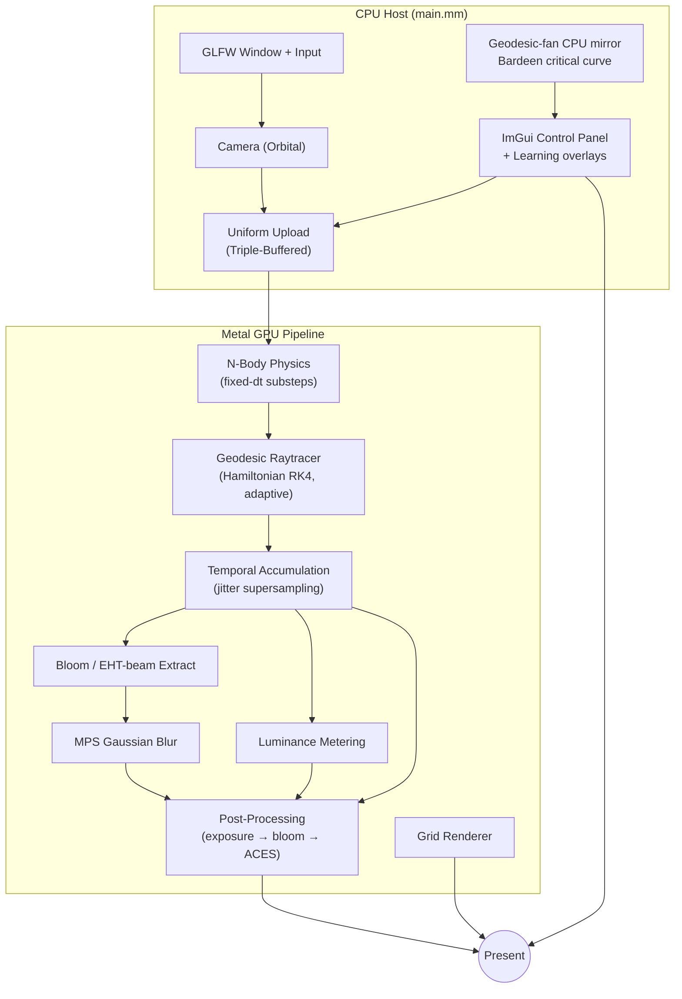

# Metal Blackhole

A high-fidelity, real-time black hole visualization and learning tool for Apple Silicon via the Metal API. The engine integrates exact null geodesics per pixel in two different spacetimes — a single Kerr-Newman hole and an exact **Majumdar-Papapetrou binary** — renders either a Novikov-Thorne thin disk or an optically-thin plasma torus with full covariant radiative transfer, outputs true HDR on XDR displays, and includes a set of toggleable **learning lenses** — the same alternative visualizations researchers use in papers (photon-ring image orders, redshift maps, checkerboard lensing skies, EHT beam convolution) — validated against a 94-test analytic GR suite.


---

## Table of Contents

- [Technical Highlights](#technical-highlights)
- [Learning Mode](#learning-mode)
- [Architecture](#architecture)
- [GPU Rendering Pipeline](#gpu-rendering-pipeline)
- [Physics Model](#physics-model)
- [Project Structure](#project-structure)
- [Controls](#controls)
- [Building](#building)
- [Presets](#presets)
- [Validation](#validation)
- [Security Considerations](#security-considerations)
- [Credits](#credits)

---

## Technical Highlights

### Core Physics & Metrics
- **Exact Kerr-Newman Metric:** Boyer-Lindquist coordinates, full mass + spin (`a`) + charge (`Q`). The charge enters every metric coefficient — the geodesic potentials, the camera tetrad, and the disk emitter — not just `Δ`.
- **Super-Hamiltonian Geodesic Integrator:** Carter-separated potentials with the momenta `(p_r, p_θ)` evolved by Hamilton's equations. Unlike the common `±√R, ±√Θ` root-tracking form, this passes smoothly through radial and polar turning points — the same choice the *Interstellar* renderer (DNGR) made for exactly this reason.
- **Past-Directed Backward Rays:** Each pixel traces the past-directed continuation of the *arriving* photon (`E = −1`), not its time-reverse — identical in Schwarzschild but essential in Kerr, where the time-reversed congruence mirrors every frame-dragging asymmetry and pairs the shadow's flattened side with the wrong Doppler side.
- **Adaptive RK4 Stepping:** Inverse-sum step controller (RAPTOR-style) with pole-proximity scaling and a stiffness term that resolves near-axis polar turning points. Coarse in the far field, fine where photons whirl near the photon shell.
- **ZAMO Camera Tetrad:** Zero-angular-momentum-observer frame, regular inside the ergosphere, with the full Kerr-Newman `g_tt`, `g_tφ`, `g_φφ` coefficients.
- **Signed Spin / Retrograde Disks:** `a < 0` renders a counter-rotating disk anchored at the **retrograde** ISCO (9M at extremal spin, vs 1M prograde), with a validity guard that emits nothing from spacelike orbits.
- **N-Body Gravity:** GPU velocity-Verlet leapfrog (KDK) at a **fixed physics timestep** (host-substepped), so orbital accuracy is independent of frame rate.
- **Dimensionless Units:** Length scale `rs = 2M`, with `M = ½` so `Δ = r² − r + a² + Q²` stays numerically well-conditioned.

### Spacetimes
- **Kerr-Newman (single hole):** mass + spin + charge, Carter-separated, past-directed congruence.
- **Majumdar-Papapetrou binary:** two extremally-charged holes in **exact** static equilibrium — a genuine solution of Einstein-Maxwell, not a superposition approximation (gravitational attraction is balanced by electrostatic repulsion). Null geodesics reduce to a strikingly simple exact form, `d²x/dλ² = (2/U)[E²∇U − (∇U·ẋ)ẋ]` with `U = 1 + Σ mᵢ/|x−xᵢ|`, and the camera setup is trivial (`ẋ = pixel direction`, `E = 1`). **There is no Carter constant here** — that is the point: the capture basin is a chaotic scatterer with a fractal boundary and self-similar "eyebrow" structures facing each companion. The Image-order lens renders the capture basins directly; the Checkerboard sky shows the lensing.

### Accretion Flow Models
- **Thin disk (optically thick):** Novikov-Thorne surface at the equator — the classic Luminet/EHT thin-disk image.
- **Volumetric torus (GRMHD-style):** an optically-thin plasma torus integrated with the covariant radiative-transfer equation `d(I_ν/ν³)/dλ = j_ν/ν² − (ν α_ν)(I_ν/ν³)`, with a non-Keplerian rotation law set by a specific-angular-momentum profile `l(R)` (the EHT code-comparison parameterization, Gold et al. 2020). Emissivity scales as `n²` (two-body/free-free), and self-absorption gives the flow a real photosphere. The Doppler asymmetry *emerges from the transport* rather than being applied by hand — at spectral index `α_s = −2` it cancels exactly, an identity the test suite verifies to machine precision.

### Rendering & Optics
- **Extended Dynamic Range:** a half-float drawable in extended-linear space with a tonemap that keeps the SDR look bit-for-bit below the knee and re-expands only the crushed highlights, so the Doppler-boosted inner limb genuinely emits ~2× above reference white on a Liquid Retina XDR panel instead of clipping to it.
- **Optically-Thick Novikov-Thorne Disk:** Page-Thorne flux `F ∝ (r_in/r)³(1 − √(r_in/r))` — zero at the ISCO (zero-torque boundary condition), peak at `(49/36) r_in`.
- **Physical Doppler Color:** A shifted blackbody is exactly another blackbody at `T_obs = g·T_emit`. The disk color comes from a baked Planck-spectrum → CIE → sRGB lookup, so the approaching limb genuinely turns blue-white and the receding limb red — no RGB tinting.
- **Correct Beaming Sign:** The g-factor is evaluated with the *arriving* photon's angular momentum (the backward-traced ray carries the opposite `L_z`), so the approaching limb brightens as `g⁴` — verified end-to-end by the test suite.
- **Photon Rings from Geodesics:** Higher-order images emerge naturally from the integrator; the Photon Ring Boost slider (0 = physical) amplifies `n ≥ 1` images for visibility.
- **Companion Stars with Occlusion:** N-body stars are sphere-intersected in world space from the ray's escape point — occluded by the disk and horizon, lensed by the geodesic bending, limb-darkened.
- **Temporal Accumulation AA:** Per-frame Halton subpixel jitter accumulates into a progressive supersample whenever the camera is static (reference-quality stills in ~64 frames); bounded history while the N-body animation runs.
- **Polar Relativistic Jets, Ergosphere Shimmer** (decorative, clearly gated).

### Projections & Export
- **Perspective**, **360° equirectangular** (2:1, for VR / spherical-video players), and **Mollweide** all-sky — a ray tracer gets these almost free, since only the pixel→direction mapping changes.
- **Reference stills:** an offline exporter renders at arbitrary resolution and projection with N accumulated jittered samples, independent of the window, and writes a **scene-linear half-float OpenEXR** (via ImageIO's native `com.ilm.openexr-image` — no third-party dependency). The file holds true radiometric values with no tonemapping or UI baked in: a typical capture peaks near 28× reference white with ~19% of components above 1.0.

### Cinematic Suite
- **ACES Filmic Tonemapping** with exposure applied before all display-referred effects.
- **Auto-Exposure:** Mean log-luminance metering that excludes empty sky, targeting middle gray.
- **MPS Bloom** with a hue-preserving, exposure-consistent luminance threshold.
- **Anamorphic Flare, Vignette (toggleable), Film Grain** (applied after the tonemap, luminance-scaled, as real grain behaves).
- **Motion Blur** as an exponential accumulation in linear HDR.

### Performance (Apple Silicon Optimized)
- **Triple Buffering** with a race-free auto-exposure readback (reads the slot the semaphore guarantees complete).
- **Precompiled `.metallib`** (dependency-tracked in the build; falls back to runtime compilation) with one consistent precision policy on both paths: relaxed math (Inf/NaN preserved), a documented 3× performance trade-off over safe math; full fast math is forbidden.
- **Adaptive stepping** typically converges rays in a few hundred steps; measured ~30 fps (thin disk) and ~21 fps (volumetric torus) at 2400×1600 on an M4 Max.
- **SIMD-Reduced Metering:** one atomic per simdgroup.
- **ARC enabled** on the Objective-C++ sources (no per-frame leaks).

---

## Learning Mode

The **Learning** panel switches the renderer between the visualizations the research community actually uses. Lenses are exclusive full-screen remappings; overlays and physics switches stack on top of any lens.

| Kind | Control | What it teaches | Precedent |
|------|---------|------------------|-----------|
| Lens | **Standard** | The photographic image | Luminet 1979, DNGR |
| Lens | **Image order** | False-color by equatorial crossing count: n=0 direct, n=1 lensed far-side/underside, n=2 photon ring | Gralla-Holz-Wald 2019, EHT photon-ring papers |
| Lens | **Redshift map** | Diverging blue-white-red map of `g = E_obs/E_emit` at the first disk hit | Standard GRRT paper figure |
| Lens | **Checkerboard sky** | Lat-long checkerboard background exposes pure lensing; repeated patches = image orders | DNGR paint-swatch test, Bohn et al. |
| Lens | **EHT view** | Image convolved with a telescope restoring beam (FWHM slider in rs) through a radio colormap | EHT Paper IV |
| Switch | **Doppler/beaming** | Full `g⁴` / color-shift-only (the *Interstellar* convention) / off (Luminet bolometric) | DNGR Fig. 15 decomposition |
| Overlay | **Orbit markers** | Coordinate-space horizon, ergosphere, photon orbit, ISCO circles | Outreach "anatomy" diagrams |
| Overlay | **Critical curve** | Bardeen's analytic shadow boundary drawn over the live image — the rendered shadow edge must land on it | Bardeen 1973, EHT Paper VI |
| Overlay | **Geodesic fan** | 2D equatorial panel: parallel rays deflecting, orbiting, and being captured | Textbook figures, Müller's teaching tools |
| Overlay | **Spacetime grid** | Embedding-diagram gravity well (star-system scale) | Standard outreach visual |

Press **L** to cycle lenses. Every false-color lens draws its own colorbar legend and caption.

---

## Architecture


```mermaid
graph TD
    subgraph Host ["CPU Host (main.mm)"]
        GLFW["GLFW Window + Input"]
        CAM["Camera (Orbital)"]
        IMGUI["ImGui Control Panel<br/>+ Learning overlays"]
        UNI["Uniform Upload<br/>(Triple-Buffered)"]
        FAN["Geodesic-fan CPU mirror<br/>Bardeen critical curve"]
    end

    subgraph GPU ["Metal GPU Pipeline"]
        PHYS["N-Body Physics<br/>(fixed-dt substeps)"]
        RAY["Geodesic Raytracer<br/>(Hamiltonian RK4, adaptive)"]
        TA["Temporal Accumulation<br/>(jitter supersampling)"]
        BLOOM_EX["Bloom / EHT-beam Extract"]
        MPS["MPS Gaussian Blur"]
        LUM["Luminance Metering"]
        POST["Post-Processing<br/>(exposure → bloom → ACES)"]
        GRID["Grid Renderer"]
    end

    GLFW --> CAM --> UNI
    IMGUI --> UNI
    FAN --> IMGUI
    UNI --> PHYS --> RAY
    RAY --> TA --> BLOOM_EX --> MPS --> POST
    TA --> LUM --> POST
    TA --> POST
    POST --> DRAW(("Present"))
    GRID --> DRAW
    IMGUI --> DRAW
```

---

## GPU Rendering Pipeline

Each frame dispatches, in order:

1. **N-Body physics** — velocity-Verlet substeps at fixed `dt ≈ 9.3e4 s` (frame-rate independent).
2. **Geodesic raytrace** — full resolution, jittered, adaptive steps, → raw HDR.
3. **Temporal accumulation** — replace / progressive-supersample / motion-blur EMA, selected by camera state.
4. **Bloom or EHT-beam extraction** (half res) + **MPS Gaussian blur**.
5. **Luminance metering** (1 sample per 4×4 block, simd-summed, sky excluded).
6. **Post-processing** — exposure → bloom → flare → vignette → ACES → grain → sRGB gamma. False-color lenses bypass the photographic chain.
7. **Grid render + overlays + ImGui.**

### Raytracer Detail

Per pixel: decompose the jittered camera ray in the ZAMO tetrad → conserved `(E=1, L_z, Q_C)` and initial momenta `(p_r, p_θ)` → adaptive RK4 on `(r, θ, φ, p_r, p_θ)`:

```
dr/dλ   = Δ p_r / Σ
dθ/dλ   = p_θ / Σ
dφ/dλ   = [a(r − Q²) − a²L]/(ΔΣ) + L/(Σ sin²θ)
dp_r/dλ = [(R/Δ)' − Δ' p_r²] / (2Σ)
dp_θ/dλ = [−2a² sinθ cosθ + 2L² cosθ/sin³θ] / (2Σ)
```

with `R(r) = P² − Δ[(L−a)² + Q_C]`, `P = r² + a² − aL`, `Σ = r² + a²cos²θ`, `Δ = r² − r + a² + Q²`. Turning points cost nothing — the momenta pass smoothly through zero. Equatorial crossings are detected by the sign flip of `cos θ` and interpolated to sub-step accuracy (valid for both crossing directions, so the disk renders correctly from below the plane). Disk hits terminate the ray (optically thick); escaped rays reconstruct a local exit direction for sky and star sampling. A polar-cap bypass handles the Boyer-Lindquist axis singularity exactly (φ jumps by π through the pole).

---

## Physics Model

### Accretion Disk

| Property | Formula | Source |
|----------|---------|--------|
| Inner Edge | `r_in = max(r_isco, 1.2 r_+)`, signed-spin ISCO branch | Bardeen-Press-Teukolsky (1972) |
| Flux | `F ∝ (r_in/r)³ (1 − √(r_in/r))` — zero at ISCO, peak at `(49/36) r_in` | Page-Thorne |
| Temperature | `T = T_peak · F_norm^(1/4)` | Novikov-Thorne |
| Circular-orbit Ω | `Ω = √(Mr − Q²) / (r² + a√(Mr − Q²))`, signed `a` | Kerr-Newman circular geodesics |
| Emitter `U^t` | `1/√(−g_tt − 2g_tφΩ − g_φφΩ²)` (KN coefficients), no emission if spacelike | Four-velocity normalization |
| g-factor | `g = 1/(U^t(1 − Ω L_arr))` with `L_arr` the **arriving** photon's `L_z` | Cunningham 1975 |
| Observed color | Blackbody at `T_obs = g·T` via Planck×CIE LUT | Liouville / DNGR |
| Observed intensity | `F_norm · min(g⁴, 15)` (bolometric; cap keeps HDR in tonemap range) | Liouville invariant |
| Static Limit | `r_E(θ) = M + √(M² − a²cos²θ)` | Kerr |

### Spin/Charge-Dependent Structure (rs units)

| Feature | a=0 | a=0.9 | a=0.998 | a=−0.9 (retro) | Q=0.5 (RN) |
|---------|-----|-------|---------|----------------|------------|
| Horizon r₊ | 1.000 | 0.718 | 0.532 | 0.718 | 0.933 |
| ISCO | 3.000 | 1.160 | 0.540 | **4.359** | 3.000* |
| Photon orbit | 1.500 | 0.778 | 0.536 | 1.955 | **1.411** |
| Shadow b_c | 2.598 | 1.42–3.42 | D-shaped | mirrored | 2.484 |

*Kerr ISCO used for charged holes (documented approximation, floored at 1.2 r₊).

---

## Project Structure

```
metal_blackhole/
├── src/
│   └── main.mm                  # Metal engine, ImGui panel, overlays, N-body scene
├── shaders/
│   └── geodesic.metal           # All GPU kernels (raytrace, accumulate, post, physics, grid)
├── include/
│   ├── ShaderCommon.h           # Shared CPU/GPU struct definitions + lens/beaming enums
│   └── Camera.h                 # Orbital camera controller
├── scripts/
│   └── build_metallib.sh        # Offline shader precompilation (fast math off)
├── tests/
│   └── validate_physics.py      # 71-test physics validation suite (fp64 shader mirror)
├── libs/imgui/                  # Dear ImGui (vendored)
├── RENDERING_INVARIANTS.md      # Critical shader invariants & lessons learned
├── CMakeLists.txt
└── README.md
```

---

## Controls

| Input | Action |
|-------|--------|
| **Left Click + Drag** | Rotate camera orbit |
| **Shift + Left Click + Drag** | Pan camera target |
| **Scroll Wheel** | Zoom in / out |
| **L** | Cycle learning lenses |
| **E** | Write the accumulated frame as a scene-linear EXR |
| **R** | Reference still: 4K, 256 accumulated samples → EXR |
| **3** | 360° panorama: 4096×2048 equirectangular, 128 samples → EXR |
| **P** | Capture screenshot (PPM) |
| **Escape** | Quit |

QA/scripting hooks (environment variables): `BH_QA=1` renders 100 frames, captures frame 90, and exits; `BH_ELEV`, `BH_AZIM`, `BH_SPIN`, `BH_CHARGE`, `BH_LENS`, `BH_BEAMING`, `BH_OVERLAYS=mcfg`, `BH_MODEL` (0 thin / 1 volumetric), `BH_ALPHA`, `BH_ABSORB`, `BH_JETS`, `BH_NOEDR`, `BH_BINARY=<separation>`, `BH_M2`, `BH_PROJ` (0/1/2), `BH_RADIUS`, `BH_EXR`, `BH_PANO`, `BH_STILL`, `BH_SHOT_DIR` override state for reproducible captures. Captures report the peak linear value and the display's EDR headroom.

---

## Building

### Requirements
- macOS with Apple Silicon (M1–M4)
- `cmake` ≥ 3.16
- `glfw` and `glm` (via Homebrew or vcpkg)
- Xcode (for precompiled `.metallib`; optional — falls back to runtime compilation)

### Build & Run
```bash
brew install cmake glfw glm

mkdir build && cd build
cmake ..
make

./MetalBlackhole
```

Shader edits are dependency-tracked: `make` refreshes the `.metallib` **and** the runtime-compile fallback copies.

---

## Presets

| Preset | Spin (a) | Charge (Q) | Notes |
|--------|----------|------------|-------|
| **Schwarzschild** | 0.0 | 0.0 | Pure GR baseline |
| **Kerr** | 0.7 | 0.0 | Frame dragging |
| **Extreme Kerr** | 0.998 | 0.0 | Near-maximal spin + jets |
| **Charged (RN)** | 0.0 | 0.5 | Reissner-Nordström (r_ph = 1.411 rs) |
| **Kerr-Newman** | 0.6 | 0.3 | Full KN metric |
| **Cinematic** | 0.85 | 0.0 | All visual effects + grid |
| **EHT M87\* view** | 0.9 | 0.0 | 17° inclination, beam-blurred EHT lens |
| **MP binary** | — | extremal | Two exact-equilibrium holes; fractal capture basins |
| **Volumetric torus** | 0.9 | 0.0 | GRMHD-style optically-thin plasma flow |
| **Luminet 1979** | 0.0 | 0.0 | Near edge-on classic view |

Spin and charge are jointly clamped to `a² + Q² ≤ 1` (no silent naked-singularity renders).

---

## Validation

```bash
python3 tests/validate_physics.py
# Expected: 94 passed, 0 failed
```

The suite mirrors the shader integrator in double precision (same ZAMO Kerr-Newman tetrad, same Hamiltonian RHS, same adaptive controller) and verifies it against closed-form GR:

| § | Test | Reference |
|---|------|-----------|
| 1 | Kerr **and** Kerr-Newman horizons, extremal RN | closed form |
| 2 | BPT ISCO, prograde **and retrograde** branches (9M limit) | BPT 1972 |
| 3 | Photon-sphere instability — a genuinely dynamical test | null geodesic condition |
| 4 | Capture boundary bisection: `|L| = √27/2` to 1e-6 | critical impact parameter |
| 5 | **Exact Darwin deflection** at b = 3…10 rs to ~1e-5 (through periapsis) | Darwin 1959 quadrature |
| 6 | RN photon sphere + traced RN capture cross-section | closed form |
| 7 | **End-to-end Doppler sign**: approaching limb g>1 from first principles | catches inversion bugs |
| 8 | Cunningham ISCO limb extremes: g = √2, √2/3, 1/√2 exactly | Cunningham 1975 |
| 9 | Carter constant (from **evolved** p_θ) + null-norm drift, on **strong-field** photon-shell grazes | genuine conservation |
| 10 | KN circular-orbit Ω: closed form vs numerical geodesic condition | metric derivatives |
| 11 | ZAMO frequency, static limit r_E(θ) | exact Kerr |
| 12 | Disk visible from below the plane (ascending-crossing regression) | — |
| 13 | **Traced shadow boundary = Bardeen critical curve** (a=0.9, both sides) + shadow-flattening/Doppler-side pairing | Bardeen 1973 |
| 14 | Adaptive-integrator self-convergence | step-halving |
| 15 | Page-Thorne flux shape (zero at ISCO, peak at 49/36 r_in) | Page-Thorne |
| 16 | Accuracy at the **exact shipped GPU step constants** (honest gates) | Darwin quadrature |
| 17 | Through-the-pole continuation (φ jumps by π across the axis) | BL chart continuation |
| 18 | **Volumetric Doppler-cancellation identity** at α_s = −2 (machine precision, with an α_s = 0 asymmetry control) | Gold et al. 2020 Test 2 |
| 19 | Radiative-transfer limits: absorption dims monotonically; optically-thick intensity saturates at the source function `S = J/A` | transfer equation |
| 20 | **MP single hole = extremal Reissner-Nordström**: critical impact parameter `b = 4m` to 3×10⁻⁸ — reached through a completely independent formulation from the Carter-separated path that gets the same number in §6 | exact solution |
| 21 | MP binary: `L_x` conserved, `\|ẋ\| = E` drift < 1e-6 (measured, not re-projected in the mirror), and exact `x → −x` reflection symmetry for equal masses | conservation / symmetry |
| 22 | Wide-separation limit: each hole's shadow → the isolated `4m` value to 1 part in 10⁴ | asymptotics |

---

## Security Considerations

- Precompiled, signed `.metallib` preferred at startup (no runtime source compilation in release use).
- All GPU uniforms clamped at the CPU→GPU write site; spin/charge jointly clamped to the black-hole family.
- Screenshots open with `O_CREAT|O_EXCL|O_NOFOLLOW` (no symlink clobbering, no overwrites).
- Build enables `-Wall -Wextra -Wformat-security -fstack-protector-strong`; the codebase compiles warning-free.

---

## Credits

Built by [mstits](https://github.com/mstits).
