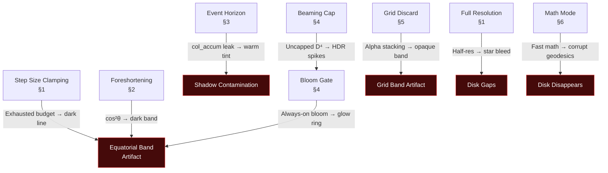
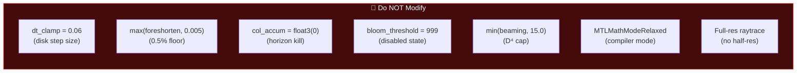

# Rendering Invariants & Lessons Learned

Hard-won rules from debugging the equatorial band artifact and validating physics accuracy.
**Violating any of these will reintroduce visual bugs.**

---

## Invariant Dependency Map

The invariants are interconnected — violating one often cascades into multiple artifacts:



---

## 1. Ray Integration Step Size

### INVARIANT: Adaptive step clamping must be bounded by BOTH position AND radius

```metal
// CORRECT — bounded by position (y < disk_h*3) AND radius (r < r_out*1.2)
if (abs(pos.y) < disk_h3 && r < r_out * 1.2f) {
    float cross_speed = min(abs(vel.y) * 10.0f, 1.0f);
    float dt_clamp = mix(0.4f, 0.06f, cross_speed);
    dt = min(dt, dt_clamp);
}

// WRONG — no radius check; exhausts 1200-iteration budget at r=50+
if (abs(pos.y) < disk_h3) dt = min(dt, 0.06f);
```

**Why:** At r=50, the default step is `50 × 0.06 = 3.0`. Clamping to 0.06 is 50× smaller. A ray
traversing from r=50 outward needs `450/0.06 = 7500` steps — far exceeding the 1200 budget.
Rays that exhaust iterations produce partial/dark output, creating a visible line at y=0.

### INVARIANT: Edge-on rays need LARGER step clamps than disk-crossing rays

Edge-on rays (vel.y ≈ 0) travel parallel to the disk slab and don't need fine vertical resolution.
They stay inside the disk slab continuously. Forcing dt=0.06 on these rays wastes the iteration
budget. Use `mix(0.4, 0.06, cross_speed)` where cross_speed scales with abs(vel.y).

### INVARIANT: Do NOT use a vel.y threshold for step clamping

```metal
// WRONG — creates a sharp brightness discontinuity at vel.y = 0.01
if (abs(vel.y) > 0.01f) dt = min(dt, 0.06f);
```

Rays at vel.y = 0.009 get large steps (miss disk). Rays at vel.y = 0.011 get tiny steps
(sample disk correctly). This creates a 1-pixel-wide brightness boundary at the equatorial plane.

### INVARIANT: Raytrace must run at FULL resolution

Half-res causes sub-pixel thin disk to bleed stars through. The disk is geometrically thin
(disk_h = 0.6 rs), so even 2× downsampling creates gaps.

---

## 2. Disk Emission Foreshortening

### INVARIANT: Use smoothstep, not cos²(θ), for geometric foreshortening

```metal
// CORRECT — gradual ramp over ~14°
float foreshorten = smoothstep(0.0f, 0.25f, vy);
foreshorten = max(foreshorten, 0.005f);

// WRONG — drops too steeply: 0.04 at 11° to 0.0025 at 3°
float foreshorten = abs_vy * abs_vy;  // cos²(θ)
```

cos²(θ) creates a dark band at the equatorial plane because the brightness drops 16× between
11° and 3° viewing angle. smoothstep provides a gradual, artifact-free transition.

### INVARIANT: Dual-mode foreshortening — init_abs_vy for primary, abs(vel.y) for lensed

```metal
float init_abs_vy = abs(vel.y);  // Store BEFORE the integration loop
// ... inside loop:
// Primary disk image: use initial camera angle (prevents photon-ring bright line)
// Secondary+ images: use current ray angle (enables gravitationally lensed crossbar)
float foreshorten_vy = (disk_crossings > 0) ? abs(vel.y) : init_abs_vy;
float foreshorten = smoothstep(0.0f, 0.25f, foreshorten_vy);
```

**Why dual-mode?** The crossbar (lensed far-side disk image) is formed by rays deflected
~180° by gravity. At the secondary crossing, the ray hits the disk at a steep angle
(`vel.y ≈ 0.9`) regardless of the original camera direction. Using `init_abs_vy` for
these rays suppresses the crossbar by 3-25× at edge-on viewing angles — making the
most iconic feature of GRRT visualizations effectively invisible.

Using `abs(vel.y)` for the primary image is still wrong (creates the equatorial bright line),
so we keep `init_abs_vy` for `disk_crossings == 0`.

---

## 3. Event Horizon & Shadow

### INVARIANT: Zero BOTH trans AND col_accum when ray enters horizon

```metal
// CORRECT — no light escapes from inside the event horizon
if (r < r_horizon * 1.01f) { trans = 0.0f; col_accum = float3(0.0f); break; }

// WRONG — accumulated disk glow leaks through as a brownish tint in the shadow
if (r < r_horizon * 1.01f) { trans = 0.0f; break; }
```

Rays that orbit the photon sphere accumulate disk emission from secondary crossings before
plunging in. If only `trans` is zeroed, the previously accumulated `col_accum` is still output,
creating a warm tint inside what should be a pure-black shadow.

---

## 4. Post-Processing Pipeline

### INVARIANT: Bloom threshold must be 999.0 (not 1.0) when disabled

HDR raytraced values regularly exceed 10.0 (beaming × 35 = huge values). A threshold of 1.0
still passes many pixels into the bloom pipeline, where MPS Gaussian blur spreads them into
a visible equatorial glow band.

### INVARIANT: Bloom composite must be gated behind a threshold check

```metal
// CORRECT — only composite when bloom is actually enabled
if (sys.bloom_threshold < 100.0f) {
    float3 bloom = bloomTex.sample(sampler(filter::linear), uv).rgb;
    col += bloom * 0.6f;
}

// WRONG — always adds bloom even when "disabled"
float3 bloom = bloomTex.sample(sampler(filter::linear), uv).rgb;
col += bloom * 0.6f;
```

### INVARIANT: Doppler beaming must be capped at 15×

The D⁴ beaming factor diverges at the inner disk limb where `cos_v × v_orbit → 1`.
Without capping, values reach 300×+, creating extreme HDR spikes that overwhelm tonemapping.

---

## 5. Grid Rendering

### INVARIANT: Grid lines at depth < 0.008 must use discard_fragment()

Alpha-blending hundreds of near-flat grid lines creates an opaque band:
`(1 - 0.03)^400 ≈ 0%` background transmission → fully opaque.

Use `discard_fragment()` for flat lines so only gravitationally curved portions are visible.

### INVARIANT: Grid fragments must be discarded where scene objects are present

The grid renders as a separate render pass ON TOP of the raytraced scene. Without
scene-occlusion checking, grid lines render through the BH shadow, accretion disk,
and stars — breaking the illusion that the grid is "below" the scene.

**Fix:** The grid fragment shader samples the HDR scene texture and discards any
fragment where `scene_luminance > 0.05`. This makes the grid invisible behind bright
objects, creating the correct visual hierarchy: BH/disk/stars in front, grid behind.

```metal
// Scene-occlusion check in grid_fragment
float3 scene = sceneTex.sample(s, screen_uv).rgb;
float scene_lum = dot(scene, float3(0.2126, 0.7152, 0.0722));
if (scene_lum > 0.05) discard_fragment();
```

**Do NOT remove this check** — it is the only thing preventing grid lines from
appearing inside the BH shadow and through the accretion disk.

### Grid Gravity Well Parameters

The grid is an **embedding diagram** — a 2D visualization of spacetime curvature.
Wells use fixed visual depths calibrated to the grid extent (±200e12):

| Object | Well Depth | Softening | Notes |
|--------|-----------|-----------|-------|
| Black Hole | 25e12 | 15e12 | Gentle funnel, ~6% of grid extent |
| Stars | 5e12 | max(3×radius, 5e12) | Proportional to mass |
| Grid Baseline | 1.5e12 | — | Below BH equatorial plane |

---

## 6. Compiler & Precision

### INVARIANT: Must use MTLMathModeRelaxed, NOT MTLMathModeFast

```objc
// CORRECT — IEEE-compliant sqrt/division for geodesic accuracy
compileOpts.mathMode = MTLMathModeRelaxed;

// WRONG — approximate sqrt/division corrupts geodesic integration
compileOpts.mathMode = MTLMathModeFast;
```

Fast math uses approximate reciprocal sqrt and division instructions. For the geodesic
integrator, these approximations compound over 1200 steps, causing the accretion disk to
disappear at edge-on viewing angles where precision is critical.

---

## 7. Physics Accuracy Checklist

### Schwarzschild (a=0) Reference Values

| Feature | Expected Value | Source |
|---------|---------------|--------|
| Event Horizon | r = 1.0 rs | Schwarzschild metric |
| Photon Sphere | r = 1.5 rs | Null geodesic condition |
| Shadow Radius | b = √27/2 ≈ 2.598 rs | Critical impact parameter |
| ISCO | r = 3.0 rs | Circular orbit stability |
| Disk T(r) | T ∝ r^(-3/4) × (1−√(rᵢₛₒ/r))^(1/4) | Novikov-Thorne |
| Redshift | g = √(1 − 1.5/r) | Circular orbit redshift |
| Shadow Interior | Pure black (RGB = 0,0,0) | No light escapes horizon |
| Polar Doppler | ~Zero (all v ⊥ LOS) | Orbital v in disk plane |

### Kerr Spin-Dependent Values

| Feature | a=0 | a=0.5 | a=0.9 | a=0.998 |
|---------|-----|-------|-------|---------|
| Horizon (r₊) | 1.000 | 0.933 | 0.718 | 0.532 |
| ISCO (prograde) | 3.000 | 2.117 | 1.160 | 0.540 |
| ZAMO ω at r=2 | 0.0 | 0.057 | 0.086 | 0.091 |

### Automated Validation

Run the physics test suite to verify all values:

```bash
python3 tests/validate_physics.py
# Expected: 47 passed, 0 failed
```

---

## 8. Diagnostic Tools

- **P key**: Saves framebuffer to `/tmp/bh_diag_<frame>.ppm` via Metal blit readback
- **Auto-capture template** (add to render loop for QA):
  ```objc
  if (frameCount == 30) camera.elevation = 1.5707f;  // edge-on
  if (frameCount == 40) screenshotPending = true;
  ```
- **PPM → PNG conversion**: `sips -s format png file.ppm --out file.png`
- **Debug ray script**: `python3 debug_ray.py` — traces a single ray through the disk to diagnose emission accumulation

---

## Quick Reference: What NOT to Change


